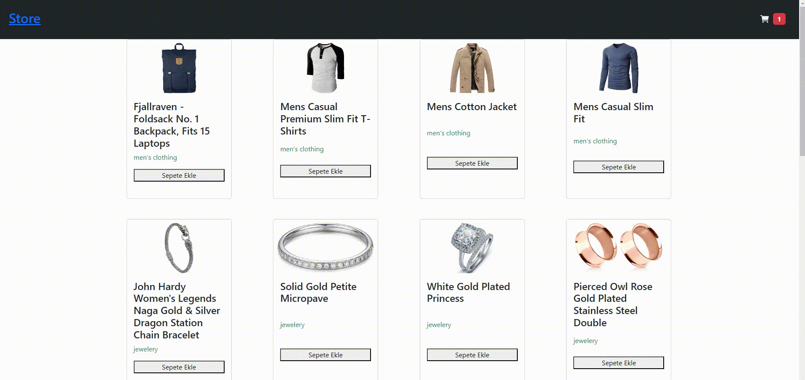

<!-- PROJECT LOGO -->
<br />
<div align="center" id="readme-top">
  <a href="https://github.com/sameteyuboglu/react-usestate-useref-axios-json-server">
    
  </a>

<h3 align="center">REACT Contex API </h3>

  <p align="center">
    createContext , useContext , Routing , useState , axios
  </p>
</div>

## Başlangıç

React ile birlikte  createContext , useContext , Routing , useState , axios kullanımı için gerekli kurulumlar

### Kurulumlar

```sh
npm create vite@latest
```

```sh
npm i react-router-dom
```

```sh
npm install axios
```


## Kullanımlar

Projemizi

```
npm create vite@latest react-context-api --template react
```

```sh
cd react-context-api
code .
```

ile oluşturuyoruz sonrasında projemizinde kullanacağımız axios'un kurulumunu yapıyoruz

```sh
npm install axios
```

routing elemanlarını kullanmak için react-router-dom

```sh
npm i react-router-dom
```

sonra projemizi ayağa kaldırıyoruz

```sh
npm run dev
```

<p align="right">(<a href="#readme-top">Başa Dön</a>)</p>


## Kullanaım Örnekleri

```
 REACT Context Api oluşturulması ve içerisinde methodlar oluşturulması

 import { createContext, useState } from "react";

export const BasketContext = createContext();

export function BasketProvider({ children }) {
  const [basket, setBasket] = useState([]);

  const addToBasket = (product) => {
    const found = basket.find((i) => i.id === product.id);
    if (found) {
      const updated = { ...found, amount: found.amount + 1 };
      const newBasket = basket.map((i) => (i.id === updated.id ? updated : i));
      setBasket(newBasket);
    } else {
      setBasket([...basket, { ...product, amount: 1 }]);
    }
  };

  const removeBasket = (product) => {
    const found = basket.find((x) => x.id === product.id);
    if (found.amount > 1) {
      const updated = { ...found, amount: found.amount - 1 };
      const newBasket = basket.map((x) => (x.id === updated.id ? updated : x));
      setBasket(newBasket);
    } else {
      const newList = basket.filter((x) => x.id !== product.id);
      setBasket(newList);
    }
  };
  return (
    <BasketContext.Provider value={{ basket, addToBasket, removeBasket }}>
      {children}
    </BasketContext.Provider>
  );
}

```

```
 Oluşturulan sayfalarda Context Nesnesine erişilmesi

 const { basket, addToBasket, removeBasket } = useContext(BasketContext);

 var olan methodların kullanılması 

  <BiSolidUpArrow
              role="button"
              className="text-success"
              onClick={() => addToBasket(i)}
            />
            <BiSolidDownArrow
              role="button"
              className="text-danger"
              onClick={() => removeBasket(i)}
            />
```


- [ x ] create Project
- [ x ] React ContextApi
- [ x ] React Routing
- [ x ] React useState
- [ x ] React useEffect
- [ x ] axios
- [ x ] json server


<p align="right">(<a href="#readme-top">Başa Dön</a>)</p>


## Son Durum

